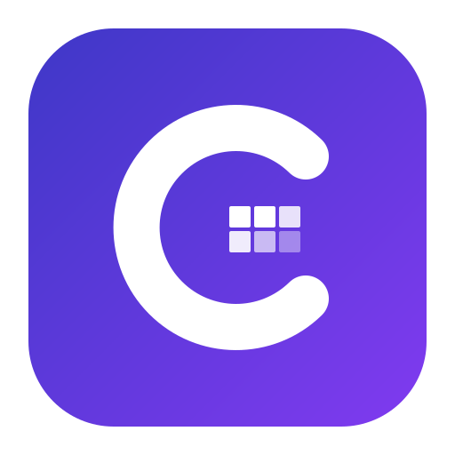

[中文](./README.zh-CN.md) | **English**

<p align="center">
  
</p>

<h1 align="center">G-Studio</h1>

<p align="center"><strong>Lightweight Game Asset Workbench</strong> — slice sprites, generate tilesets, draw regions, edit maps, all in one place.</p>

**[Live Demo](https://huzz-open.github.io/g-studio/)** · [GitHub](https://github.com/huzz-open/g-studio)

---

G-Studio is a browser-based toolset for 2D game development, designed especially for Godot Engine projects. All data stays local — no server, no login required.

## Try It Out

A sample sprite sheet is included in the [`samples/`](./samples/) directory for testing:


Open the Sprite Slicer module, drag and drop this image in, and try the auto-detection feature.

## Features

| Module | Description |
|--------|-------------|
| **Resource Manager** | Browse local workspace directories, manage images and data files |
| **Sprite Slicer** | Auto/manual slice animation frames, icons, and items from sprite sheets |
| **Map Editor** | Edit world maps, place locations, draw roads and regions |
| **Tileset Maker** | Generate 47-tile auto-terrain atlases from textures or nine-grid sources, export Godot `.tres` |
| **Scene Region Editor** | Draw collision/occlusion regions on scene backgrounds, export Godot `.tscn` |

## Getting Started

### Prerequisites

- [Node.js](https://nodejs.org/) >= 18
- [pnpm](https://pnpm.io/) >= 8

### Install & Run

```bash
git clone https://github.com/huzz-open/g-studio.git
cd g-studio
pnpm install
pnpm dev
```

Open `http://localhost:5173` in your browser.

### Build

```bash
pnpm build
```

Output goes to `dist/`. Deploy as a static site anywhere.

## Browser Compatibility

G-Studio uses the [File System Access API](https://developer.mozilla.org/en-US/docs/Web/API/File_System_Access_API) to read/write local directories. Recommended:

- Chrome / Edge >= 86
- Other browsers work in "browser-only mode" (data stored in IndexedDB, not persisted to disk)

## Tech Stack

- Vue 3 + TypeScript + Vite
- Vue Router (Hash mode)
- IndexedDB + File System Access API (two-layer storage)
- OpenCV.js (image processing)

## License

[Apache License 2.0](./LICENSE)
