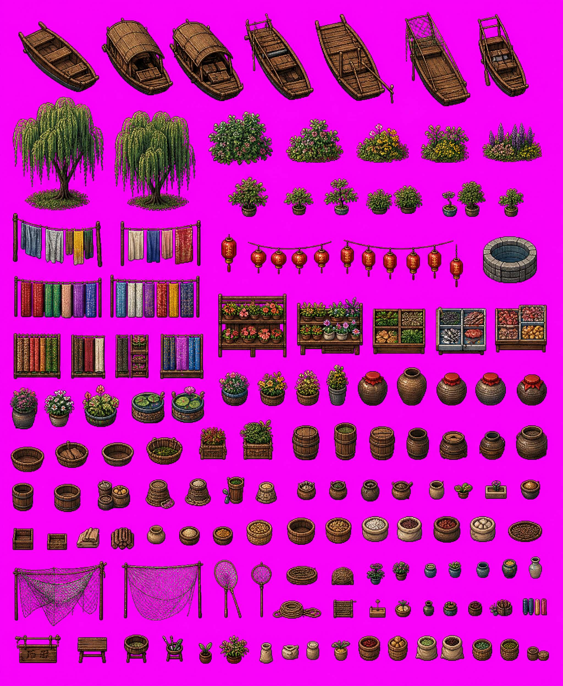

**中文** | [English](./README.md)

# G-Studio

**轻量级游戏资源工作台** — 切图、拼图、画区域、编地图，一站搞定。

**[在线体验](https://huzz-open.github.io/g-studio/)** · [GitHub](https://github.com/huzz-open/g-studio)

---

G-Studio 是一个运行在浏览器中的游戏开发辅助工具集，专为 2D 游戏（特别是 Godot 引擎项目）设计。所有数据保存在本地，无需服务器，无需登录。

## 试一试

[`samples/`](./samples/) 目录中包含一张测试用的 Sprite Sheet：



打开切图工具模块，将这张图片拖入，即可体验自动检测切割功能。

## 功能模块

| 模块 | 说明 |
|------|------|
| **资源管理器** | 浏览本地工作区目录，管理图片和数据文件，查看元数据 |
| **切图工具** | 从 Sprite Sheet 中自动/手动切割动画帧、图标和物件 |
| **地图编辑器** | 编辑世界地图，放置地点、绘制道路和区域 |
| **Tileset 生成器** | 从纹理或九宫格素材生成 47-tile 自动地形图集，导出 Godot `.tres` |
| **场景区域编辑器** | 在场景背景图上绘制碰撞/遮挡区域，导出 Godot `.tscn` |

## 快速开始

### 环境要求

- [Node.js](https://nodejs.org/) >= 18
- [pnpm](https://pnpm.io/) >= 8

### 安装与运行

```bash
git clone https://github.com/huzz-open/g-studio.git
cd g-studio
pnpm install
pnpm dev
```

浏览器打开 `http://localhost:5173` 即可使用。

### 构建

```bash
pnpm build
```

产物输出到 `dist/` 目录，可部署为纯静态站点。

## 浏览器兼容性

G-Studio 使用 [File System Access API](https://developer.mozilla.org/en-US/docs/Web/API/File_System_Access_API) 读写本地目录。推荐使用：

- Chrome / Edge >= 86
- 其他浏览器可在"仅浏览器模式"下使用（数据存储在 IndexedDB，不持久化到磁盘）

## 技术栈

- Vue 3 + TypeScript + Vite
- Vue Router（Hash 模式）
- IndexedDB + File System Access API（双层存储）
- OpenCV.js（图像处理）

## 许可证

[Apache License 2.0](./LICENSE)
