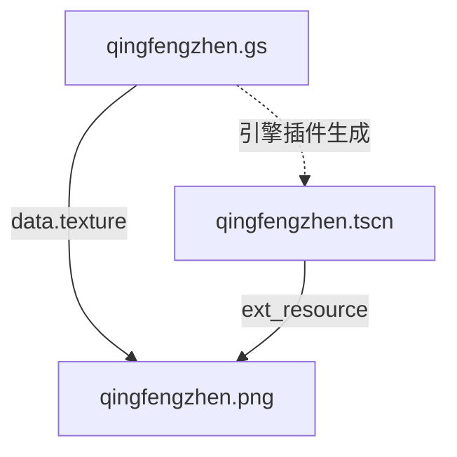
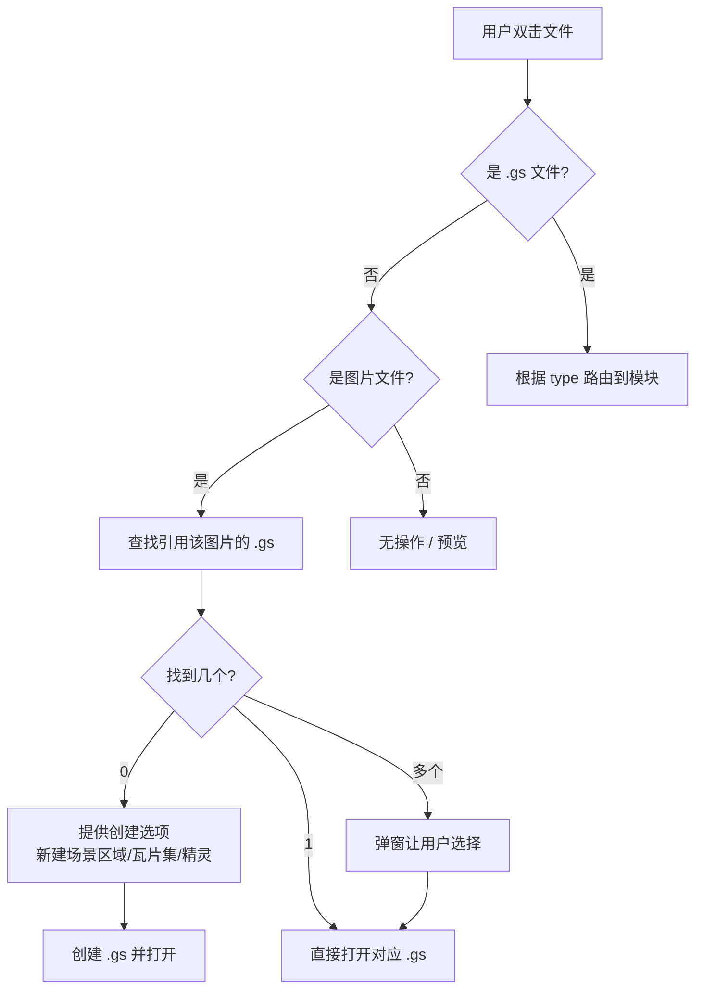

# 03 - 资源模型重新设计

## 概述

Engine Bridge 架构下，G-Studio 的资源模型需要从"每个文件是独立资源"转变为"以 .gs 为核心资源单位"。本文档分析 .meta 系统的去留、新的资源关系模型、以及打开/导航逻辑。

## 旧模型 vs 新模型

### 旧模型

```
每个文件 + .meta sidecar = 一个独立资源
├── qingfengzhen.png + .qingfengzhen.png.meta (uid, contentHash, moduleData)
├── terrain.png + .terrain.png.meta
└── hero-spritesheet.png + .hero-spritesheet.png.meta
```

- 每个文件有 uid 身份
- moduleData 存储模块特定状态（如切分配置）
- relations 追踪派生关系

### 新模型

```
.gs 文件 = 一等资源（主体）
├── qingfengzhen.gs → 引用 qingfengzhen.png（附属）
├── terrain.gs → 引用 terrain.png（附属）
└── hero.gs → 引用 hero-spritesheet.png（附属）
```

- .gs 文件是用户操作的核心对象
- 图片是 .gs 的附属引用，不再独立管理
- 模块状态直接存储在 .gs `data` 中（无需 moduleData）
- 身份由 .gs 文件路径确定（无需 uid）

## .meta 系统分析

### 当前 .meta 提供的能力

| 能力 | 用途 | 新模型下是否仍需 |
|------|------|-----------------|
| uid | 唯一标识，跨重命名追踪 | .gs 文件本身即身份，无需额外 uid |
| contentHash | 检测文件内容变化 | .gs 有 version 字段替代 |
| boundFileName | 绑定文件名 | 不需要，路径即身份 |
| moduleData | 存储模块状态 | 不需要，状态在 .gs data 中 |
| relations | 追踪派生关系 | 不需要，.gs 中用 texture 字段表达引用 |
| openWith | 决定打开方式 | 不需要，.gs type 字段决定 |
| pipeline | 记录处理历史 | 不需要 |
| tags | 分类标签 | 可选，但可以用文件夹组织替代 |

### 结论

**在 Engine Bridge 架构下，.meta sidecar 系统可以完全废弃。**

理由：
1. .gs 文件内部已包含了所有需要的元信息（type、version、data）
2. 文件身份由路径确定，不需要 uid（文件移动 = 引用断裂 → 用户手动修复或通过资源管理器的移动功能自动更新 .gs 中的路径）
3. 模块状态在 .gs data 中，不需要外挂 moduleData
4. 引用关系在 .gs data.texture 中，不需要 relations

### 迁移策略

- 新功能（Engine Bridge 相关）不使用 .meta
- 现有已用 .meta 的功能（sprite-slicer、tileset-maker）在适配到 .gs 格式后废弃其 .meta 依赖
- `.g-studio/uid-index.json` 不再需要
- 过渡期两套并存，逐步迁移

## 新的资源关系

### .gs 文件的引用图



- .gs → 图片：通过 `data.texture` 相对路径
- .gs → .tscn：隐含关系（同名同目录），由引擎插件管理
- .tscn → 图片：通过引擎自己的资源引用系统

### 引用索引

为了支持"双击图片 → 找到引用它的 .gs"，需要一个内存索引：

```typescript
// 运行时构建的反向索引（不持久化）
type TextureRefIndex = Map<string, string[]>
// key: 图片相对路径（如 "assets/scenes/qingfengzhen.png"）
// value: 引用该图片的 .gs 文件路径列表
```

构建时机：
- 工作区打开时全量扫描 .gs 文件
- .gs 文件保存时增量更新
- 资源管理器刷新时重建

## 打开资源的统一逻辑



### 路由规则

| .gs type | 目标模块 | 路由 |
|----------|---------|------|
| 1 (SceneRegion) | 场景区域编辑器 | `/scene-region-editor?gs=<path>` |
| 2 (Tileset) | 瓦片集制作器 | `/tileset-maker?gs=<path>` |
| 3 (Sprite) | 精灵切分器 | `/sprite-slicer?gs=<path>` |
| 4 (WorldMap) | 地图编辑器 | `/map-editor?gs=<path>` |

## Tab 模型

**每个编辑器 Tab 对应一个 .gs 文件**（或一个未保存的新建状态）。

- Tab 标题 = .gs 文件名（无扩展名）
- Tab 有未保存修改时显示 `*` 标记
- Ctrl+S 保存到 .gs 文件
- 关闭 Tab 时如有未保存修改 → 提示保存

无工作区时：
- Tab 标题 = "未命名" 或用户指定的名称
- Ctrl+S 不可用（灰色）
- 只能通过"导出"下载

## .gs 文件的发现和扫描

### 工作区扫描

工作区打开/刷新时，递归扫描所有 `.gs` 文件：

```typescript
interface GsFileEntry {
  path: string           // 相对于工作区根的路径
  type: GsType           // 从 JSON 中快速读取的 type 字段
  name: string           // 从 data.name 读取
  texture: string        // 从 data.texture 读取的引用路径
  regionCount?: number   // data.regions.length（SceneRegion 类型时）
}
```

扫描策略：
- 首次打开：全量扫描，读取每个 .gs 的头部字段（不需要读完整 data）
- 保存后：增量更新对应条目
- 手动刷新：全量重新扫描

### 非 .gs 文件的处理

资源管理器仍然显示所有文件（.png、.tscn、.gd 等），但：
- .gs 文件作为"主资源"高亮显示（特殊图标）
- 图片文件如果被 .gs 引用则显示关联标记
- .tscn 文件显示为"引擎场景"，不可在 G-Studio 中编辑
- 其他文件正常显示，提供基本文件操作（重命名、移动、删除）
