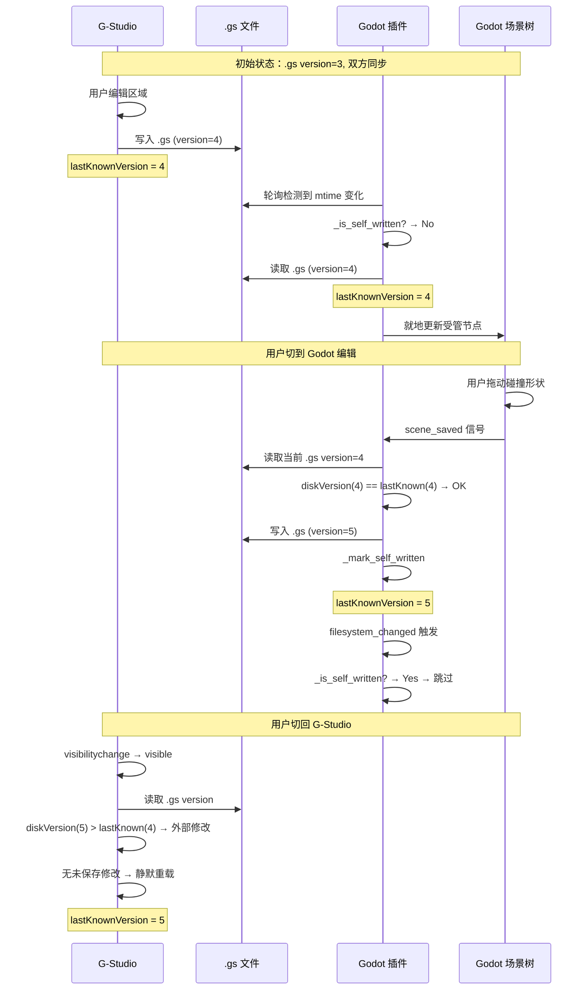

# 06 - 双向同步协议

## 概述

G-Studio 和引擎编辑器通过 .gs 文件实现双向数据同步。本文档定义同步协议的细节：version 机制、冲突检测、防循环、变更感知。

## 同步模型

```
G-Studio (浏览器)          .gs (磁盘)          引擎插件
       │                      │                    │
       │── 写入 ─────────────►│                    │
       │                      │◄── file watch ─────│
       │                      │                    │── 读取+更新场景树
       │                      │                    │
       │                      │◄── 保存回写 ────────│
       │◄── focus重读 ────────│                    │
       │── 读取+更新UI        │                    │
```

双方通过 .gs 文件进行间接通信，不存在直接连接。

## version 机制

### 规则

1. .gs 文件有一个 `version` 字段，初始值为 1
2. **每次任何端写入 .gs 时，version 必须 +1**
3. 每个端在读取 .gs 后记住当前 version（记为 `lastKnownVersion`）
4. 写入前检查磁盘上的 version 是否等于 `lastKnownVersion`
5. 如果不等（磁盘 version > lastKnownVersion）→ 冲突

### 写入流程

```typescript
async function writeGsFile(path: string, newData: object): Promise<WriteResult> {
  // 1. 读取当前磁盘 version
  const diskContent = await readFile(path)
  const diskVersion = JSON.parse(diskContent).version

  // 2. 冲突检查
  if (diskVersion > lastKnownVersion) {
    return { status: 'conflict', diskVersion, expectedVersion: lastKnownVersion }
  }

  // 3. 写入新版本
  const newVersion = diskVersion + 1
  const fileContent = { ...newData, version: newVersion }
  await writeFile(path, JSON.stringify(fileContent, null, 2))

  // 4. 更新内存中的 lastKnownVersion
  lastKnownVersion = newVersion

  return { status: 'ok', newVersion }
}
```

### 引擎插件侧（GDScript）

```gdscript
var _last_known_versions: Dictionary = {}  # path → version

func _write_gs(path: String, data: Dictionary) -> bool:
    # 读取当前 version
    var current = _read_gs_file(path)
    var disk_version = current.get("version", 0)
    var expected = _last_known_versions.get(path, 0)

    if disk_version > expected:
        # 冲突
        push_warning("[G-Studio] Conflict on %s: disk=%d, expected=%d" % [path, disk_version, expected])
        return false

    # 写入
    data["version"] = disk_version + 1
    var f = FileAccess.open(path, FileAccess.WRITE)
    f.store_string(JSON.stringify(data, "  "))
    f.close()

    _last_known_versions[path] = data["version"]
    _mark_self_written(path)
    return true
```

## 冲突处理

### 冲突场景

用户同时在 G-Studio 和 Godot 中编辑同一个 .gs 关联的场景，且两边都做了修改：

```
时间线：
T1: G-Studio 读取 .gs (version=3)
T2: Godot 保存场景 → 插件写 .gs (version=4)
T3: G-Studio 用户 Ctrl+S → 检测到 disk version=4 > lastKnown=3 → 冲突！
```

### 冲突解决策略（v1）

**v1 不做自动合并，采用"提示 + 用户选择"策略：**

G-Studio 侧：
```typescript
if (writeResult.status === 'conflict') {
  const choice = await showConflictDialog({
    message: '文件已被外部修改（可能是 Godot 插件保存的）',
    options: [
      { id: 'reload', label: '放弃本地修改，重新加载' },
      { id: 'overwrite', label: '覆盖外部修改，使用本地版本' },
    ],
  })

  if (choice === 'reload') {
    await reloadFromDisk()
  } else if (choice === 'overwrite') {
    // 强制写入（version 从当前磁盘值 +1）
    await forceWriteGsFile(path, newData)
  }
}
```

引擎插件侧：
```gdscript
if not _write_gs(path, data):
    # 冲突 → 放弃回写，保持 .gs 中的版本
    # 下次场景打开时会从 .gs 同步最新数据
    push_warning("[G-Studio] Write conflict, skipping write-back for: " + path)
```

### 未来优化（v2+）

- 字段级合并：比对双方修改的 region，只有修改了相同 region 才算真正冲突
- 三方合并：记录 base version，计算双方 diff，自动合并不冲突的部分

## 防循环机制

### 问题

引擎插件同时监听 .gs 文件变化和场景保存事件：
1. .gs 变化 → 更新场景树
2. 场景保存 → 回写 .gs
3. 回写触发 .gs 变化 → 又要更新场景树 → 无限循环

### 解决方案

插件记录自己写入的文件和时间戳：

```gdscript
var _self_written_files: Dictionary = {}  # path → write_timestamp

func _mark_self_written(path: String) -> void:
    _self_written_files[path] = Time.get_unix_time_from_system()

func _is_self_written(path: String) -> bool:
    if not _self_written_files.has(path):
        return false
    var written_at = _self_written_files[path]
    var now = Time.get_unix_time_from_system()
    # 2秒内的变更视为自己写的
    if now - written_at < 2.0:
        _self_written_files.erase(path)
        return true
    # 超时，可能是外部修改
    _self_written_files.erase(path)
    return false

func _on_filesystem_changed() -> void:
    for gs_path in _find_changed_gs_files():
        if _is_self_written(gs_path):
            continue  # 跳过自己写的
        _sync_gs_to_scene(gs_path)
```

### G-Studio 侧

G-Studio 不监听文件变化（因为浏览器没有文件系统 watcher）。它通过 visibilitychange 事件在获得焦点时重读。因此不需要防循环——它只在用户主动切回时读取。

## 变更感知

### 引擎插件侧（主动监听）

利用 Godot 的 `EditorFileSystem` 信号：

```gdscript
func _enter_tree():
    var efs = EditorInterface.get_resource_filesystem()
    efs.filesystem_changed.connect(_on_filesystem_changed)

func _on_filesystem_changed():
    _check_gs_file_changes()
```

或者用 mtime 轮询（更可靠，因为 filesystem_changed 不保证即时）：

```gdscript
var _gs_file_mtimes: Dictionary = {}  # path → mtime

func _process(delta):
    _poll_timer += delta
    if _poll_timer < 1.0:  # 每秒检查一次
        return
    _poll_timer = 0.0
    _check_gs_mtimes()

func _check_gs_mtimes():
    for path in _tracked_gs_files:
        var mtime = FileAccess.get_modified_time(path)
        if mtime != _gs_file_mtimes.get(path, 0):
            _gs_file_mtimes[path] = mtime
            if not _is_self_written(path):
                _sync_gs_to_scene(path)
```

### G-Studio 侧（被动感知）

利用浏览器的 `visibilitychange` 事件：

```typescript
document.addEventListener('visibilitychange', () => {
  if (document.visibilityState === 'visible') {
    checkExternalChangesForOpenTabs()
  }
})

async function checkExternalChangesForOpenTabs(): Promise<void> {
  for (const tab of openTabs) {
    if (!tab.gsPath) continue
    const diskContent = await readFile(tab.gsPath)
    const diskVersion = JSON.parse(diskContent).version

    if (diskVersion > tab.lastKnownVersion) {
      if (tab.hasUnsavedChanges) {
        showToast({
          type: 'warning',
          message: `"${tab.name}" 已被外部修改，是否重新加载？`,
          action: { label: '重新加载', onClick: () => tab.reload() },
        })
      } else {
        // 无未保存修改 → 静默更新
        await tab.reload()
      }
    }
  }
}
```

## 同步时序完整示例



## 边界情况

### .gs 文件不存在（首次）

- G-Studio Ctrl+S 时直接创建（version=1）
- 引擎插件检测到新 .gs → 首次生成 .tscn

### .gs 文件被外部工具修改（如文本编辑器直接改 JSON）

- 引擎插件正常检测到 mtime 变化 → 执行同步
- G-Studio 下次获得焦点时检测到 version 变化 → 重载

### .gs 文件 JSON 损坏

- 解析失败时不执行同步，不覆盖磁盘内容
- 显示错误提示给用户
- 等待用户修复（如 git revert）

### 网络文件系统延迟

- mtime 轮询间隔 1 秒，足以覆盖正常 NFS 延迟
- 如果 mtime 不可靠（某些网络文件系统），降级为内容 hash 比对
