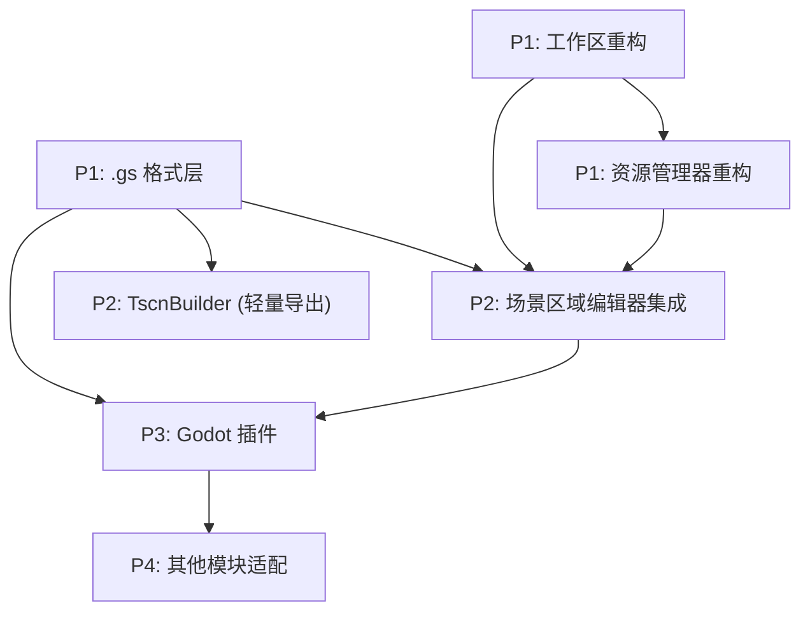

# 08 - 分阶段实施计划

## 概述

Engine Bridge 功能按依赖关系和优先级分为 4 个阶段实施。每个阶段有明确的验收标准和可交付物。

## 依赖关系图



## P1：基础架构

### 任务 1.1：.gs 格式层

**文件**：`src/shared/gs-format/`

| 文件 | 内容 |
|------|------|
| `types.ts` | GsFile, GsType, SceneRegionData, SceneRegion, RegionType, RegionGroup 接口和枚举 |
| `schema.ts` | 校验函数（validateGsFile, validateSceneRegionData）|
| `reader.ts` | readGsFile(handle) → GsFile，从 FileSystemFileHandle 读取并校验 |
| `writer.ts` | writeGsFile(handle, data) → void，序列化 JSON 并写入 |
| `index.ts` | 统一导出 |

**接口定义**：

```typescript
// types.ts
export enum GsType {
  SceneRegion = 1,
  Tileset = 2,
  Sprite = 3,
  WorldMap = 4,
}

export enum RegionType {
  Occlude = 1,
  Collision = 2,
}

export enum RegionGroup {
  TopLayer = 1,
  YSort = 2,
  ScreenMask = 3,
  Opacity50 = 4,
}

export interface GsFile<T = unknown> {
  gs: 1
  type: GsType
  gen: string
  version: number
  data: T
}

export interface SceneRegionData {
  name: string
  texture: string
  size: [number, number]
  y_sort: boolean
  regions: SceneRegion[]
}

export interface SceneRegion {
  id: string
  name: string
  type: RegionType
  groups?: RegionGroup[]
  verts?: [number, number][]
  rect?: [number, number, number, number]
}
```

**验收标准**：
- 能创建符合 schema 的 GsFile 对象
- 能序列化为 JSON 字符串
- 能从 JSON 字符串解析并校验
- 校验失败时 throw Error（不静默降级）

### 任务 1.2：工作区重构

**改动文件**：`src/shared/workspace/workspace-manager.ts`

改动点：
1. `initWorkspaceStructure()` → 检测 `project.godot` 是否存在
2. 如果存在：只创建 `.g-studio/` + `.gdignore` + `config.json`
3. 删除预设目录创建逻辑（`spritesheets/`, `icons/` 等）
4. config.json 记录 `mode: 'godot-project'`

**验收标准**：
- 选择含 project.godot 的目录 → 只创建 .g-studio/ → 无预设目录
- 选择普通目录 → 只创建 .g-studio/ → 无预设目录
- 已有旧工作区（有预设目录）→ 正常打开，不报错

### 任务 1.3：资源管理器重构

**新建文件**：
- `src/shared/components/ContextMenu.vue`
- `src/shared/module-registry/index.ts`

**改动文件**：
- `src/modules/resource-manager/components/FileGrid.vue` — 右键事件 + .gs 卡片渲染
- `src/modules/resource-manager/components/DirectoryTree.vue` — 文件夹右键
- `src/modules/resource-manager/components/FilePreview.vue` — .gs 感知预览
- `src/modules/resource-manager/components/ResourceManagerView.vue` — 菜单处理

**验收标准**：
- 右键文件 → 弹出上下文菜单
- 右键文件夹 → 弹出文件夹菜单
- .gs 文件显示特殊图标和摘要
- 双击 .gs → 路由到对应模块
- 双击图片 → 查找关联 .gs → 打开或提供创建选项
- 右键图片 → "新建场景区域" → 创建 .gs 文件

## P2：场景区域编辑器集成

### 任务 2.1：编辑器接入工作区

**改动文件**：
- `src/modules/scene-region-editor/store.ts` — 添加 save/load .gs 逻辑
- `src/modules/scene-region-editor/components/SceneRegionEditorView.vue` — Ctrl+S 绑定 + visibilitychange

功能点：
1. Ctrl+S → 保存为 .gs 文件（绑定模式）
2. 从 .gs 文件加载恢复编辑状态
3. visibilitychange → 检测外部修改 → 提示/静默重载
4. Tab 标题显示文件名 + 未保存标记

**验收标准**：
- 右键图片 → 新建场景区域 → 进入编辑器 → 画区域 → Ctrl+S → .gs 文件正确写入
- 重新打开 .gs → 恢复所有区域
- 在外部修改 .gs（如文本编辑器）→ 切回 G-Studio → 检测到变更并重载
- 无工作区时 Ctrl+S 不可用

### 任务 2.2：TscnBuilder 重构

**文件**：`src/shared/godot/tscn-builder.ts`（新建）

轻量模式导出用的类型安全 .tscn 构建器。不走 Godot 插件，直接在浏览器中生成 .tscn 文本。

功能：
- 管理 ext_resource / sub_resource / node 声明
- 正确的 ID 分配和引用
- Godot 4 format=3 格式输出
- 支持 PackedVector2Array、Vector2 等值类型格式化

**验收标准**：
- 生成的 .tscn 能被 Godot 4.x 正常打开
- 包含 Sprite2D（背景图）+ Obstacles + StaticBody2D 完整结构
- 坐标与 .gs 中一致

### 任务 2.3：轻量模式导出 UI

**改动文件**：
- `src/modules/scene-region-editor/components/RegionListPanel.vue` — 导出菜单

功能：
- 导出按钮下拉菜单
- "导出 .gs" → 下载 JSON
- "导出 .gs + 图片" → 下载 zip
- "导出 .tscn" → 通过 TscnBuilder 生成并下载

**验收标准**：
- 无工作区时可用
- 下载的 .gs 文件格式正确
- 下载的 .tscn 能被 Godot 打开

## P3：Godot 插件

### 任务 3.1：插件骨架

**文件**：`addons/g_studio/` 目录（在 Godot 项目中，不在 G-Studio 项目中）

创建插件基本结构：
- plugin.cfg + plugin.gd
- gs_file_watcher.gd（mtime 轮询）
- gs_scene_manager.gd（分发给 handler）

**验收标准**：
- 插件可在 Godot 中正常启用/禁用
- 能检测到项目中的 .gs 文件
- 打印日志确认检测到变更

### 任务 3.2：结构识别 + 首次生成

**文件**：`addons/g_studio/handlers/scene_region_handler.gd`

功能：
- recognize() — 从场景树提取受管区域
- createScene() — 从 .gs 创建完整 .tscn
- 结构规则匹配逻辑

**验收标准**：
- 放入 .gs 文件 → 插件自动生成同名 .tscn
- .tscn 打开后有 Sprite2D + Obstacles + StaticBody2D
- 所有区域正确对应

### 任务 3.3：就地更新

**文件**：scene_region_handler.gd 的 apply() 方法

功能：
- .gs 变化时更新已打开场景的受管节点
- 增删改三种操作
- 非受管节点不受影响

**验收标准**：
- G-Studio 添加区域 → Godot 场景中出现新节点
- G-Studio 删除区域 → Godot 场景中对应节点消失
- G-Studio 修改顶点 → Godot 场景中形状更新
- 用户添加的 Player 等节点不受影响

### 任务 3.4：保存回写

**文件**：gs_scene_manager.gd 的 on_scene_saving()

功能：
- 场景保存时扫描受管节点
- 提取当前数据
- 对比 .gs version → 写入或报冲突
- 防循环标记

**验收标准**：
- Godot 中拖动区域 → 保存 → .gs 文件中坐标更新
- Godot 中新建规范 Area2D → 保存 → .gs 出现新 region
- 快速来回编辑 → 无循环 → 数据最终一致

### 任务 3.5：打包排除提示

**文件**：plugin.gd 的 _enable_plugin()

功能：
- 检查 export_presets.cfg 是否已排除 *.gs
- 未排除时在 Output 面板输出提示

**验收标准**：
- 首次启用插件 → 输出提示信息
- 已配置排除 → 不输出

## P4：完善体验

### 任务列表（优先级排序）

1. 资源管理器 .gs 缩略图（从引用图片生成）
2. .gs 文件卡片摘要信息
3. Tileset handler（type=2 的 .gs → TileSet .tres）
4. Sprite handler（type=3 的 .gs → SpriteFrames）
5. 版本冲突解决 UI（非 Toast，专门的对话框）
6. Godot FileSystem dock 自定义图标
7. 拖入 .gs 文件恢复编辑（轻量模式恢复）

## 里程碑

| 里程碑 | 内容 | 可演示功能 |
|--------|------|-----------|
| M1 (P1 完成) | 基础架构就绪 | 资源管理器中右键图片→新建.gs→编辑→保存 |
| M2 (P2 完成) | 编辑器集成 | 完整的 .gs 编辑/保存/加载/导出 循环 |
| M3 (P3 完成) | 双向同步 | G-Studio 改→Godot 看到, Godot 改→G-Studio 看到 |
| M4 (P4 完成) | 完整生态 | 多模块支持 + 完善的 UI |

## 风险和缓解

| 风险 | 概率 | 影响 | 缓解 |
|------|------|------|------|
| Godot EditorFileSystem 信号不可靠 | 中 | 插件检测不到 .gs 变化 | 降级为 mtime 轮询 |
| visibilitychange 在某些浏览器不触发 | 低 | G-Studio 检测不到外部修改 | 手动刷新按钮作为后备 |
| .gs 格式需要升级 | 中 | 旧文件不兼容 | gs 字段记录格式版本，迁移时检查 |
| 同时编辑导致频繁冲突 | 低 | 用户体验差 | 文档建议工作流：一边编辑完再切换 |
