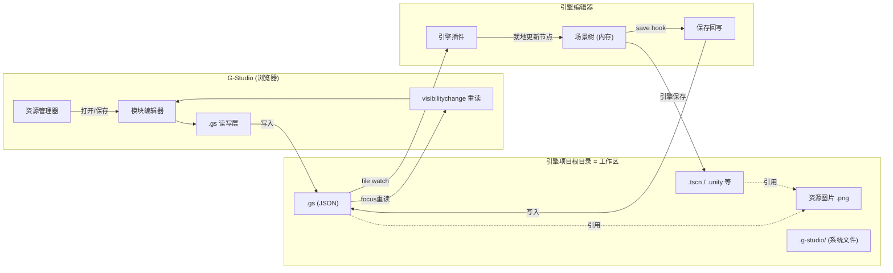

# G-Studio Engine Bridge 设计文档

## 项目概述

G-Studio Engine Bridge 是 G-Studio 与游戏引擎（首先支持 Godot）之间的双向同步桥接层。它允许用户在 G-Studio 中进行批量化的 2D 场景资源编辑（碰撞区域、遮挡区域、瓦片集、精灵切分等），然后在游戏引擎中直接使用并微调，修改结果自动回流到 G-Studio。

## 设计原则

1. **.gs 是引用式文件** — 通过相对路径引用图片等资源，与 .tscn 同类，不追求独立可用
2. **结构即协议** — 通过场景树的层级结构和命名约定识别受管节点，无需隐藏 metadata
3. **引擎插件不写 .tscn** — 仅操作内存中的场景树，.tscn 的序列化完全由引擎负责
4. **引擎插件唯一写的文件是 .gs** — 单一写入方向，避免格式风险
5. **工作区 = 引擎项目根目录** — G-Studio 资源管理器直接管理整个项目文件结构
6. **无工作区 = 无保存** — 只有绑定了工作区才能 Ctrl+S，否则只能导出/下载
7. **资源管理器是枢纽** — 所有模块通过资源管理器访问文件，以 .gs 为核心资源单位
8. **无 engine 区** — .gs 只存储 G-Studio 业务数据，非受管节点仅存在于引擎文件中

## 文档索引

| 文件 | 内容 | 实施阶段 |
|------|------|---------|
| [01-gs-format-spec.md](./01-gs-format-spec.md) | .gs 文件格式完整规范 | P1 |
| [02-engine-adapter.md](./02-engine-adapter.md) | 引擎适配器抽象层设计 | P1 概念 / P3 实现 |
| [03-resource-model.md](./03-resource-model.md) | 资源模型重新设计 | P1 |
| [04-resource-manager-ui.md](./04-resource-manager-ui.md) | 资源管理器 UI 重构 | P1 |
| [05-workspace-strategy.md](./05-workspace-strategy.md) | 工作区绑定策略 | P1 |
| [06-sync-protocol.md](./06-sync-protocol.md) | 双向同步协议 | P2-P3 |
| [07-godot-adapter.md](./07-godot-adapter.md) | Godot 适配器具体实现 | P3 |
| [08-implementation-phases.md](./08-implementation-phases.md) | 分阶段实施计划 | 全程参考 |

## 架构总览

## 数据职责划分

| 数据 | 存储位置 | 管理者 |
|------|---------|--------|
| 区域（碰撞/遮挡）| .gs `data.regions` | G-Studio + 引擎插件双端 |
| 背景图引用 | .gs `data.texture` | G-Studio |
| 用户自由节点 | 仅引擎文件 (.tscn) | 引擎编辑器（插件不碰）|

**.gs 管理业务数据，引擎文件管理引擎工作内容。两者各司其职，不互相兜底。**
